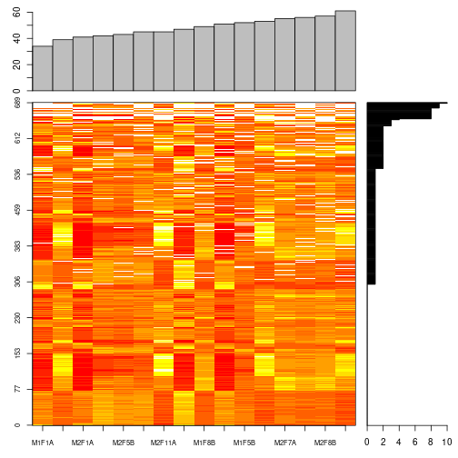
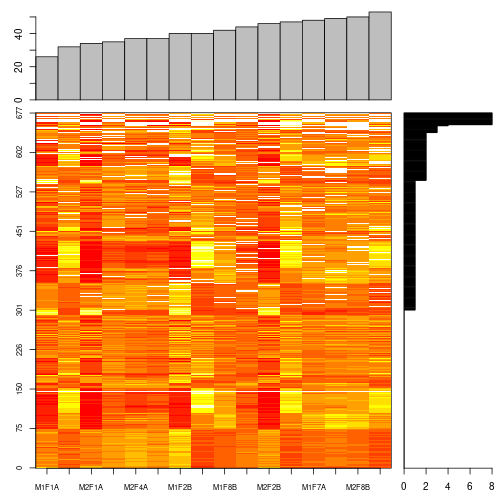
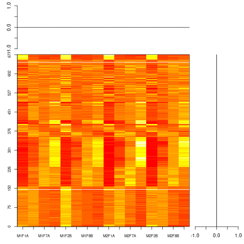
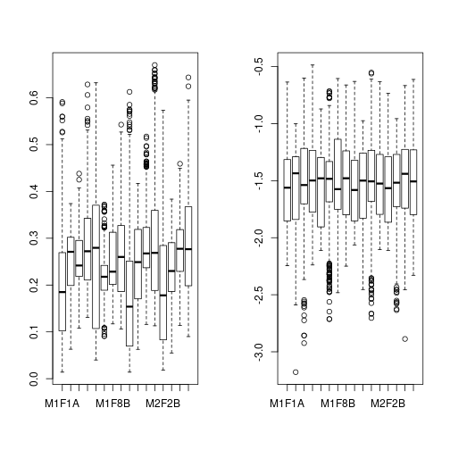
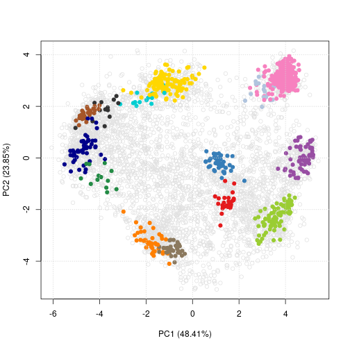
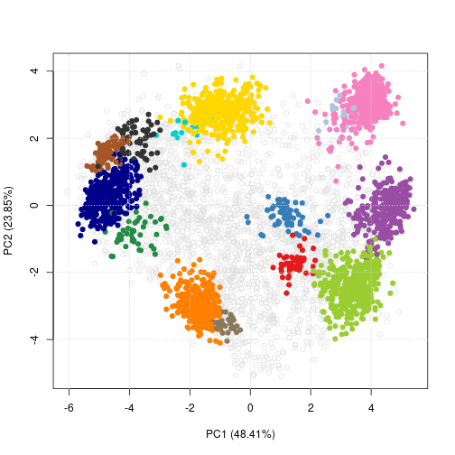
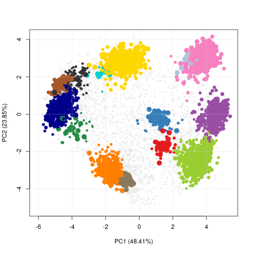
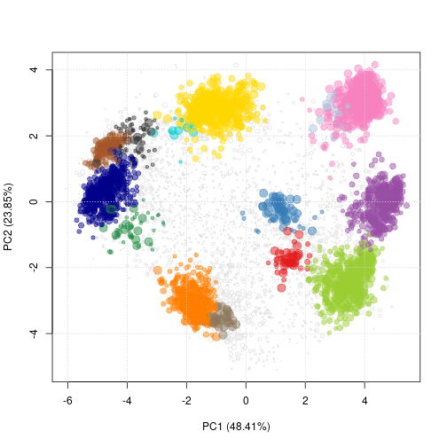
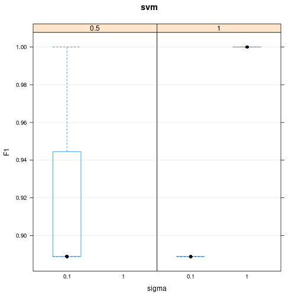
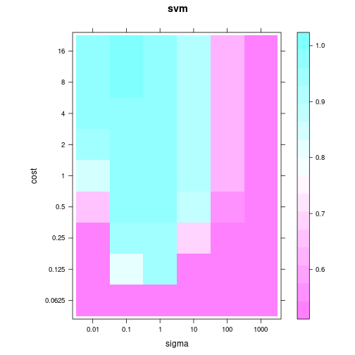

# Introduction

1. Use case: Quantitative MS-based spatial proteomics (intro from
   [https://zenodo.org/record/1435058](https://zenodo.org/record/1435058)]
2. [Data structure](http://lgatto.github.io/pRoloc/articles/Figures/msnset.png)


# Demo

## Working environment


```r
suppressPackageStartupMessages(library("MSnbase"))
library("pRoloc")
library("pRolocdata")
setStockcol(NULL)
library("pRolocGUI")
library("magrittr")
```

## Loading data into R


```r
f0 <- dir(system.file("extdata", package = "pRolocdata"),
	  full.names = TRUE,
	  pattern = "Dunkley2006")
basename(f0)
```

```
## [1] "Dunkley2006.csv.gz"
```

```r
res <- readMSnSet2(f0, ecol = 5:20)
res
```

```
## MSnSet (storageMode: lockedEnvironment)
## assayData: 689 features, 16 samples 
##   element names: exprs 
## protocolData: none
## phenoData: none
## featureData
##   featureNames: 1 2 ... 689 (689 total)
##   fvarLabels: Protein.ID Loc.Predicted ... pd.markers (6 total)
##   fvarMetadata: labelDescription
## experimentData: use 'experimentData(object)'
## Annotation:  
## - - - Processing information - - -
##  MSnbase version: 2.8.0
```

## Accessing data and meta-data


```r
data(hyperLOPIT2015)
x <- hyperLOPIT2015
exprs(x)
```

```
##                                           X126.rep1 X127N.rep1 X127C.rep1
## Q9JHU4                                        0.028      0.034      0.024
## Q9QXS1-3                                      0.039      0.134      0.095
## Q9ERU9                                        0.021      0.013      0.014
## P26039                                        0.120      0.255      0.148
## Q8BTM8                                        0.055      0.139      0.078
##                                           X128N.rep1 X128C.rep1 X129N.rep1
## Q9JHU4                                         0.014      0.026      0.045
## Q9QXS1-3                                       0.053      0.084      0.121
## Q9ERU9                                         0.009      0.024      0.054
## P26039                                         0.091      0.135      0.095
## Q8BTM8                                         0.050      0.077      0.098
##                                           X129C.rep1 X130N.rep1 X130C.rep1
## Q9JHU4                                         0.107      0.341      0.059
## Q9QXS1-3                                       0.107      0.128      0.122
## Q9ERU9                                         0.116      0.257      0.209
## P26039                                         0.041      0.057      0.014
## Q8BTM8                                         0.093      0.171      0.079
##                                           X131.rep1 X126.rep2 X127N.rep2
## Q9JHU4                                        0.321     0.037      0.064
## Q9QXS1-3                                      0.117     0.033      0.073
## Q9ERU9                                        0.284     0.026      0.017
## P26039                                        0.043     0.111      0.181
## Q8BTM8                                        0.160     0.062      0.108
##                                           X127C.rep2 X128N.rep2 X128C.rep2
## Q9JHU4                                         0.058      0.059      0.067
## Q9QXS1-3                                       0.074      0.062      0.081
## Q9ERU9                                         0.023      0.029      0.039
## P26039                                         0.141      0.144      0.152
## Q8BTM8                                         0.091      0.086      0.099
##                                           X129N.rep2 X129C.rep2 X130N.rep2
## Q9JHU4                                         0.078      0.140      0.208
## Q9QXS1-3                                       0.142      0.190      0.069
## Q9ERU9                                         0.071      0.105      0.171
## P26039                                         0.119      0.075      0.028
## Q8BTM8                                         0.111      0.117      0.095
##                                           X130C.rep2 X131.rep2
## Q9JHU4                                         0.141     0.147
## Q9QXS1-3                                       0.151     0.125
## Q9ERU9                                         0.304     0.215
## P26039                                         0.017     0.033
## Q8BTM8                                         0.144     0.087
##  [ reached getOption("max.print") -- omitted 5027 rows ]
```

```r
pData(x)
```

```
##            Replicate TMT.Reagent Acquisiton.Method Gradient.Fraction
## X126.rep1          1        X126               MS3           Cytosol
## X127N.rep1         1       X127N               MS3   1 to 6 (pooled)
## X127C.rep1         1       X127C               MS3   8 to 9 (pooled)
## X128N.rep1         1       X128N               MS3 10 to 11 (pooled)
## X128C.rep1         1       X128C               MS3                12
## X129N.rep1         1       X129N               MS3                14
## X129C.rep1         1       X129C               MS3                16
## X130N.rep1         1       X130N               MS3                18
## X130C.rep1         1       X130C               MS3         Chromatin
## X131.rep1          1        X131               MS3                19
## X126.rep2          2        X126               MS3           Cytosol
## X127N.rep2         2       X127N               MS3   1 to 6 (pooled)
## X127C.rep2         2       X127C               MS3   7 to 9 (pooled)
## X128N.rep2         2       X128N               MS3 10 to 11 (pooled)
## X128C.rep2         2       X128C               MS3                12
## X129N.rep2         2       X129N               MS3 14 to 15 (pooled)
## X129C.rep2         2       X129C               MS3                17
## X130N.rep2         2       X130N               MS3 18 to 19 (pooled)
## X130C.rep2         2       X130C               MS3         Chromatin
## X131.rep2          2        X131               MS3                20
##            Iodixonal.Density
## X126.rep1                0.0
## X127N.rep1               6.0
## X127C.rep1              11.0
## X128N.rep1              13.3
## X128C.rep1              14.6
## X129N.rep1              17.4
## X129C.rep1              20.1
## X130N.rep1              26.8
## X130C.rep1                NA
## X131.rep1               34.5
## X126.rep2                0.0
## X127N.rep2               5.2
## X127C.rep2              10.0
## X128N.rep2              12.5
## X128C.rep2              14.0
## X129N.rep2              17.3
## X129C.rep2              20.9
## X130N.rep2              24.7
## X130C.rep2                NA
## X131.rep2               31.9
```

```r
fData(x)
```

```
##           entry.name
## Q9JHU4   DYHC1_MOUSE
## Q9QXS1-3  PLEC_MOUSE
## Q9ERU9    RBP2_MOUSE
##                                                                                                                         protein.description
## Q9JHU4                                              Cytoplasmic dynein 1 heavy chain 1 OS=Mus musculus GN=Dync1h1 PE=1 SV=2 - [DYHC1_MOUSE]
## Q9QXS1-3 Isoform PLEC-1 of Plectin OS=Mus musculus GN=Plec - [PLEC_MOUSE]|Isoform PLEC-1A of Plectin OS=Mus musculus GN=Plec - [PLEC_MOUSE]
## Q9ERU9                                                     E3 SUMO-protein ligase RanBP2 OS=Mus musculus GN=Ranbp2 PE=1 SV=2 - [RBP2_MOUSE]
##          peptides.rep1 peptides.rep2 psms.rep1 psms.rep2 phenodisco.input
## Q9JHU4             175           166       322       273          unknown
## Q9QXS1-3           123           150       174       198          unknown
## Q9ERU9             101            90       181       129          unknown
##          phenodisco.output curated.phenodisco.output markers
## Q9JHU4             unknown                   unknown unknown
## Q9QXS1-3           unknown                   unknown unknown
## Q9ERU9        Phenotype 10                   unknown unknown
##           svm.classification svm.score svm.top.quartile
## Q9JHU4            Peroxisome     0.303          unknown
## Q9QXS1-3        60S Ribosome     0.223          unknown
## Q9ERU9   Nucleus - Chromatin     0.737          unknown
##             final.assignment first.evidence curated.organelles
## Q9JHU4               unknown              N            unknown
## Q9QXS1-3             unknown              N            unknown
## Q9ERU9   Nucleus - Chromatin              N            unknown
##          cytoskeletal.components trafficking.proteins protein.complexes
## Q9JHU4                    Dynein              unknown            Dynein
## Q9QXS1-3                 unknown              unknown           unknown
## Q9ERU9                   unknown              unknown           unknown
##          signalling.cascades oct4.interactome nanog.interactome
## Q9JHU4               unknown          unknown           unknown
## Q9QXS1-3             unknown          unknown           unknown
## Q9ERU9               unknown          unknown              Prey
##          sox2.interactome cell.surface.proteins markers2015
## Q9JHU4            unknown               unknown     unknown
## Q9QXS1-3          unknown               unknown     unknown
## Q9ERU9               Prey               unknown     unknown
##          TAGM.tagm.map.allocation TAGM.tagm.map.probability
## Q9JHU4        Nucleus - Chromatin         0.999890448591981
## Q9QXS1-3          Plasma membrane      2.77171228994874e-31
## Q9ERU9        Nucleus - Chromatin         0.505396080186473
##          TAGM.tagm.mcmc.allocation TAGM.tagm.mcmc.probability
## Q9JHU4         Nucleus - Chromatin          0.999999983161247
## Q9QXS1-3           Plasma membrane          0.756777645518832
## Q9ERU9         Nucleus - Chromatin          0.999998979930214
##          TAGM.tagm.mcmc.outlier TAGM.tagm.mcmc.shannon
## Q9JHU4                1.0000000           2.996505e-07
## Q9QXS1-3              0.0000000           2.991686e-01
## Q9ERU9                0.9976667           1.493198e-05
##  [ reached 'max' / getOption("max.print") -- omitted 5029 rows ]
```

## Missing data


```r
data(naset)
naplot(naset)
```



```r
filterNA(naset, pNA = 0.5) %>%
    naplot
```



```r
naset %>%
    filterNA( pNA = 0.5) %>%
    impute(method = "knn") %>%
    naplot
```



```r
res <- naset %>%
    filterNA( pNA = 0.5) %>%
    impute(method = "knn")
```

## Normalisation


```r
par(mfrow = c(1, 2))
boxplot(exprs(res))

res %>%
    normalise(method = "vsn") %>%
    exprs %>%
    boxplot
```

```
## vsn2: 677 x 16 matrix (1 stratum).
```

```
## Please use 'meanSdPlot' to verify the fit.
```



## Dimensionality reduction


```r
hl <- hyperLOPIT2015
plot2D(hl)
```



```r
fvarLabels(hl)
```

```
##  [1] "entry.name"                "protein.description"      
##  [3] "peptides.rep1"             "peptides.rep2"            
##  [5] "psms.rep1"                 "psms.rep2"                
##  [7] "phenodisco.input"          "phenodisco.output"        
##  [9] "curated.phenodisco.output" "markers"                  
## [11] "svm.classification"        "svm.score"                
## [13] "svm.top.quartile"          "final.assignment"         
## [15] "first.evidence"            "curated.organelles"       
## [17] "cytoskeletal.components"   "trafficking.proteins"     
## [19] "protein.complexes"         "signalling.cascades"      
## [21] "oct4.interactome"          "nanog.interactome"        
## [23] "sox2.interactome"          "cell.surface.proteins"    
## [25] "markers2015"               "TAGM"
```

```r
plot2D(hl, fcol = "final.assignment")
```



```r
ptz <- exp(fData(hl)$svm.score) - 1
plot2D(hl, fcol = "final.assignment", cex = ptz)
```



```r
setStockcol(paste0(getStockcol(), 80))
plot2D(hl, fcol = "final.assignment", cex = ptz)
```



## Classification


```r
data(tan2009r1)

## params <- svmOptimisation(tan2009r1, fcol = "markers.orig",
##               times = 100, xval = 5,
##               verbose = FALSE)

fn <- dir(system.file("extdata", package = "pRoloc"),
      full.names = TRUE, pattern = "params.rda")
load(fn, verbose = TRUE)
```

```
## Loading objects:
##   params
```

```r
params
```

```
## Object of class "GenRegRes"
## Algorithm: svm 
## Hyper-parameters:
##  cost: 0.0625 0.125 0.25 0.5 1 2 4 8 16
##  sigma: 0.01 0.1 1 10 100 1000
## Design:
##  Replication: 10 x 5-fold X-validation
##  Partitioning: 0.2/0.8 (test/train)
## Results
##  macro F1:
##    Min. 1st Qu.  Median    Mean 3rd Qu.    Max. 
##  0.8889  0.8889  1.0000  0.9556  1.0000  1.0000 
##  best sigma: 0.1 1   
##  best cost: 0.5 1
```

```r
plot(params)
```



```r
levelPlot(params)
```



```r
svmres <- svmClassification(tan2009r1, fcol = "markers.orig",
			    sigma = 1, cost = 1)
fvarLabels(svmres)
```

```
##  [1] "FBgn"                  "Protein.ID"           
##  [3] "Flybase.Symbol"        "AccessionNo"          
##  [5] "EntryName"             "AccessionNoAll"       
##  [7] "EntryNameAll"          "No.peptide.IDs"       
##  [9] "Mascot.score"          "No.peptide.quantified"
## [11] "PLSDA"                 "pd.2013"              
## [13] "pd.markers"            "markers.orig"         
## [15] "markers"               "markers.tl"           
## [17] "svm"                   "svm.scores"
```

```r
svmres <- svmClassification(tan2009r1, fcol = "markers.orig",
			    assessRes = params)
processingData(svmres)
```

```
## - - - Processing information - - -
## Added markers from  'mrk' marker vector. Thu Jul 16 22:53:44 2015 
## Performed svm prediction (sigma=0.1 cost=0.5) Mon Nov  5 09:40:24 2018 
##  MSnbase version: 1.17.12
```

```r
fvarLabels(svmres)
```

```
##  [1] "FBgn"                  "Protein.ID"           
##  [3] "Flybase.Symbol"        "AccessionNo"          
##  [5] "EntryName"             "AccessionNoAll"       
##  [7] "EntryNameAll"          "No.peptide.IDs"       
##  [9] "Mascot.score"          "No.peptide.quantified"
## [11] "PLSDA"                 "pd.2013"              
## [13] "pd.markers"            "markers.orig"         
## [15] "markers"               "markers.tl"           
## [17] "svm"                   "svm.scores"
```

## Interactive visualisation


Offline


```r
pRolocVis(hl)
```

or online at [https://lgatto.shinyapps.io/christoforou2015/](https://lgatto.shinyapps.io/christoforou2015/).

# References

Breckels LM, Mulvey CM, Lilley KS and Gatto L. **A Bioconductor
workflow for processing and analysing spatial proteomics data**
[version 2; referees: 2 approved]. F1000Research 2018, 5:2926
(https://doi.org/10.12688/f1000research.10411.2)

`pRoloc` documentation: http://lgatto.github.io/pRoloc/

Gatto L, Lilley KS. MSnbase-an R/Bioconductor package for isobaric
tagged mass spectrometry data visualization, processing and
quantitation. Bioinformatics.  2012 Jan 15;28(2):288-9. doi:
10.1093/bioinformatics/btr645. Epub 2011 Nov 22.  PubMed PMID:
22113085.

`MSnbase` documentation: http://lgatto.github.io/MSnbase/

Gatto L, Breckels LM, Naake T, Gibb S. **Visualization of proteomics
data using R and bioconductor**. Proteomics. 2015
Apr;15(8):1375-89. doi: 10.1002/pmic.201400392. Review. PubMed PMID:
25690415; PubMed Central PMCID: PMC4510819.

Gatto L, Christoforou A. **Using R and Bioconductor for proteomics
data analysis**. Biochim Biophys Acta. 2014 Jan;1844(1 Pt
A):42-51. doi: 10.1016/j.bbapap.2013.04.032. Epub 2013
May 18. Review. PubMed PMID: 23692960.
